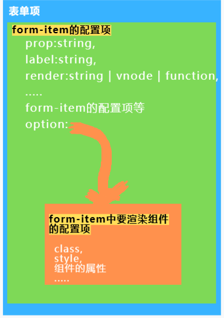

# 介绍

`z-element-ui` 使用数据驱动,所以在使用之前,对数据格式的理解能更快的让你上手.
## table介绍

如果你使用过 `andt design of vue` 那么你会对 `z-table` 很快上手.

它主要需要两个参数 `tableColumn` 与 `tableData` ,`tableColumn` 为表头数据, `tableData` 为表格数据.


## form介绍

在 `form` 表单中 `items` 属性中,可以分为以下结构



`items`可以理解为 `form-item` 的集合, `items` 中的每一条数据都为一项 `form-item` .

其中放入 `form-item` option 字段中的所有属性都将会被 `bind` 到该组件上,包括自定义组件.


```html
<el-form>
	<el-form-item label="审批人">
    	<el-input v-model="form.user" placeholder="审批人"></el-input>
  	</el-form-item>
    <el-form-item label="性别">
    	<el-input v-model="form.gender" placeholder="性别"></el-input>
  	</el-form-item>
</el-form>  
```

上面这样的dom结构用 `z-form` 实现的  `items` 为:

```js
items:[
    {
		prop:'user', 
		label:'审批人',
		render:'el-input' //可省略,默认为'el-input'
    },
    {
    	prop:'gender',
    	label:'性别',
    }
]
```

::: warning

与 `el-form` 相关的配置项保留 `el-form` 原生的使用方法,依旧是在dom上增加相关属性

:::